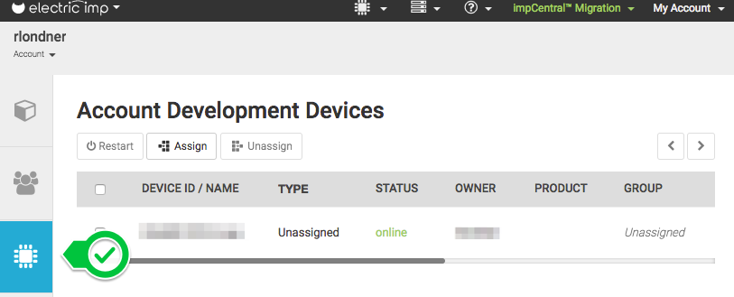
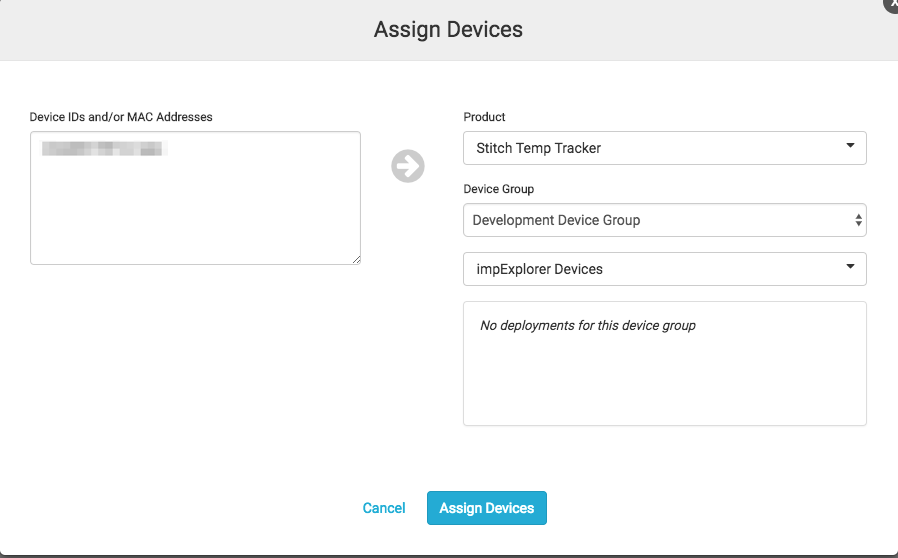
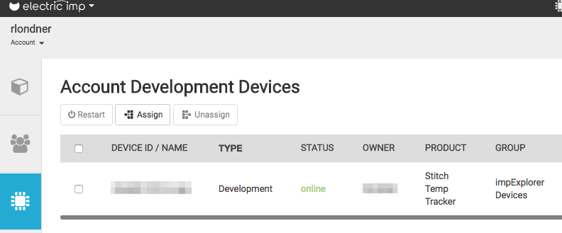
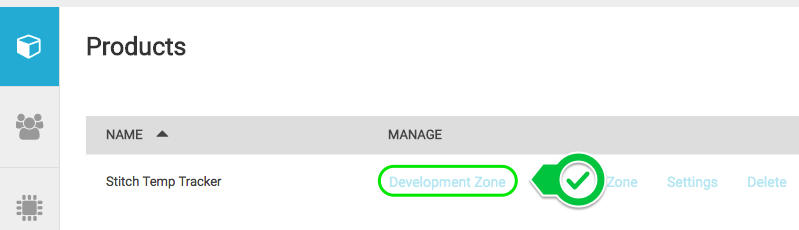
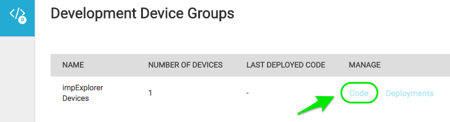
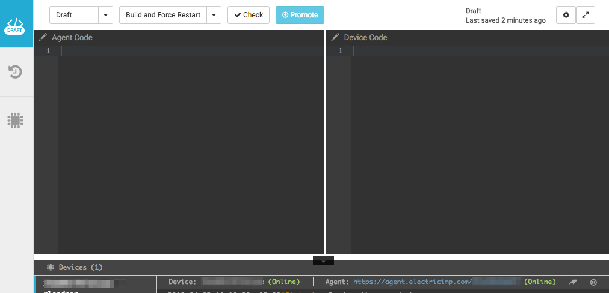
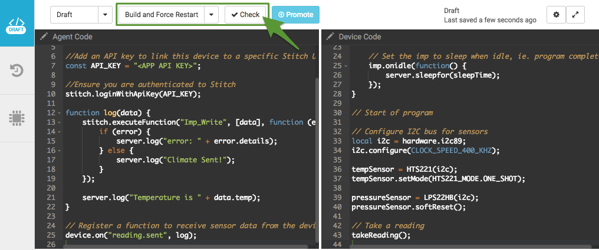
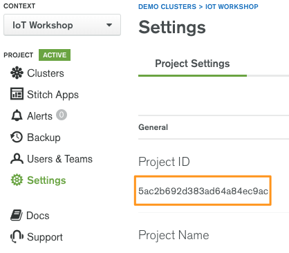
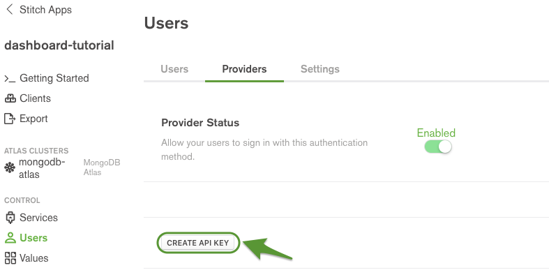

# Workshop: Build an IoT Temperature Sensor with MongoDB Stitch & ElectricImp

## What We’ll Build

In this tutorial, we’ll combine an ElectricImp impExplorer wireless sensor kit with MongoDB Stitch and Atlas to create a realtime dashboard that charts temperature and uses text messages to alert on high temperatures. 

We’ll use ElectricImp to do the following:

* Capture temperature and humidity with the ElectricImp impExplorer 

* Securely connect to AWS and pass information to MongoDB Stitch 

We’ll use Stitch to do the following:

* Store the impExplorer’s data in a MongoDB Atlas cloud database

* Connect your data to a D3.js dashboard 

* Connect your app to additional services: 

    * Combine with outside temperature data from DarkSky

    * Send a text message with Twilio if the temperature is too high

## Prerequisites

You’ll need the following prerequisites before beginning this tutorial:

* An ElectricImp Explorer Kit*

* An account for [impCentral](https://impcentral.electricimp.com), ElectricImp’s cloud IDE 

* The ElectricImp app installed on your phone ([iOS](https://itunes.apple.com/us/app/electric-imp/id547133856) or [Android](https://play.google.com/store/apps/details?id=com.electricimp.electricimp))

* A [MongoDB Atlas](https://cloud.mongodb.com/user/register?jmp=docs) cluster running MongoDB version 3.4 or greater. You can complete this tutorial with a free M0 MongoDB Atlas cluster. For information on creating an M0 cluster, see the [Atlas Getting Started Guide](https://docs.atlas.mongodb.com/getting-started/#atlas-getting-started)

* A MongoDB Atlas [Account API Key](https://docs.atlas.mongodb.com/configure-api-access/#generate-api-key) for your project.

* A [properly installed](https://docs.mongodb.com/stitch/import-export/stitch-cli-reference/#installation) copy of [stitch-cli](https://docs.mongodb.com/stitch/import-export/overview/) that has been added to your system PATH.

    * [Mac Download Link](https://s3.amazonaws.com/stitch-clis/stitch_cli_linux_64_f5ccf267ba3588e370d046d86f5b5a54cbe8e76f_18_03_26_20_15_48/macos-amd64/stitch-cli)  

    * [Windows Download Link](https://s3.amazonaws.com/stitch-clis/stitch_cli_linux_64_f5ccf267ba3588e370d046d86f5b5a54cbe8e76f_18_03_26_20_15_48/windows-amd64/stitch-cli.exe)

    * [Linux Download Link](https://s3.amazonaws.com/stitch-clis/stitch_cli_linux_64_f5ccf267ba3588e370d046d86f5b5a54cbe8e76f_18_03_26_20_15_48/linux-amd64/stitch-cli)

* Node.js version 6.0.0 or newer. See the [Node.js docs](https://nodejs.org/en/download/) for installation instructions.

* A copy of the [Stitch-ElectricImp Lab Code](http://bit.ly/StitchImp)

* (Optional) A copy of [MongoDB Compass Community Edition](https://www.mongodb.com/download-center#compass) (to view your MongoDB Atlas data)

* A DarkSky API key*

* A Twilio account*

** Provided for this lab by your host – MongoDB*

## Procedure

### **A. Setting up your ElectricImp**

This tutorial uses the ElectricImp [impExplorer™ Developer Kit](https://store.electricimp.com/products/impexplorer-developer-kit?variant=31118866130). The device will read climate data and send it to MongoDB Stitch. Before setting up, make an account for ElectricImp’s [IDE](https://ide.electricimp.com/ide) and download the ElectricImp app (on an [iOS](https://itunes.apple.com/us/app/electric-imp/id547133856) or [Android](https://play.google.com/store/apps/details?id=com.electricimp.electricimp) phone). Your ElectricImp account will link to your device and contains an online editor for the device code.

#### Setting up the Imp

To start, unpack the impExplorer. It should include a board, a card (a WiFi IoT module), and a USB power cord. Start by inserting the card into the board and powering it on by attaching the provided cable and then plugging it into a USB port on a computer or a USB wall adapter.

After powering on the board, use the ElectricImp app to [blink up](https://electricimp.com/docs/gettingstarted/explorer/blinkup/) the board. This connects the board to the internet and assigns it to your account so that you can deploy code to it. If the board times out and the LED stops flashing, restart and try again.

**NOTE**

For this lab we will be using the following wi-fi:

**Network**: xgen_public

**Password**: mongodbatlas

For more information or troubleshooting, see the [impExplorer Getting Started Guide](https://electricimp.com/docs/gettingstarted/explorer/account/).

#### Deploying the Code

Now that the device is blinked up, build out the code to work with the device. Electric Imp breaks down the code into two components:

* **Device Code** – reads inputs from the sensors on the impExplorer

* **Agent Code** – ensures that the device communicates reliably and securely with the internet

Both the device and agent code used in this tutorial can be found in the [repository root directory](https://github.com/rlondner/mongodb-stitch-imp-workshop). After downloading or cloning the repository, sign into impCentral, the ElectricImp [IDE](https://ide.electricimp.com/ide).

For more information see the [tour of the Imp IDE](https://developer.electricimp.com/gettingstarted/explorer/ide).

To load the code onto the device, follow the steps below:

**Create a product and link the device**

After signing in, you should by default see the __Products__ tab (with no Product). Follow the instructions below:

1. Navigate to the **Devices** tab and verify that your imp device shows up as unassigned (Type column below)

2. Navigate back to the **Products** tab and click *Create a Product* 

3. In the *Create Product* text box, enter **_Stitch Temp Tracker_** (or whichever value of your liking)

4. In the *Create Development Device* text box, enter **_impExplorer Devices_** (or whichever value of your liking). Click the Create button to create your development environment

5. Navigate back to the **Devices** tab, select your device and assign it to the **_Stitch Temp Tracker_** product and **_impExplorer Devices_** device group, as shown in the screenshot below:

6. Press *Assign Devices* and *Done*. Verify that your device is now assigned to the proper Product and Group, as shown below:

#### Add code, build, and run

Navigate back to the Products tab and select *Development Environment* for the Stitch Temp Tracker product:

In the Development Device Groups page, select the **_Code_** link:

The Imp IDE has a split window, with a space for the **Agent** code on the left and **Device** code on the right and **Development Device Logs** below. 

To add code onto the device do the following:

1. Copy-paste the code from the file **_temp.device.nut_** to the **Device** pane (on the right)

2. Copy-paste the code from the file **_temp.agent.nut_** to the **Agent** IDE (on the left)

3. Make sure **Build and ****Force Restart **is selected and click the **Check** button to deploy your code to the device and agent, as show below:

### **B. Create and Import a new Stitch Application**

All of the Stitch components needed to run the dashboard app are available in the [Stitch-ElectricImp Lab Code](http://bit.ly/StitchImp).

The TempApptemperature-lab directory contains configurations for the following Stitch entities:

* An [API key authentication provider](https://docs.mongodb.com/stitch/auth/apikey-auth/)

* A [MongoDB service](https://docs.mongodb.com/stitch/mongodb/) that will link with your Atlas cluster. The service has been configured to connect to the Climate collection in the Data database. The default [rules](https://docs.mongodb.com/stitch/mongodb/mongodb-rules/) have been removed from this collection which means that anyone can read and write all fields of any document in the collection.

* A [Stitch function](https://docs.mongodb.com/stitch/functions/) named RecentTemp that returns data from MongoDB for temperatures collected between the given start and end times.

We will use the [stitch-cli import](https://docs.mongodb.com/stitch/import-export/overview/) command to create a new Stitch application that is populated with these entities.

#### Navigate to the Pre-Configured Application Directory

Navigate to the dashboard-initial application directory from the stitch-examples directory:

`cd mongodb-stitch-imp-workshop/TempApp/`

#### Authenticate a MongoDB Atlas User

To import the pre-configured application directory, users must authenticate with Atlas using an [API key](https://docs.atlas.mongodb.com/configure-api-access/#generate-api-key).

Pass your Atlas API key and Atlas login e-mail to the [stitch-cli](https://docs-mongodbcom-staging.corp.mongodb.com/stitch/nick/DOCSP-2009/import-export/stitch-cli-reference.html#stitch-cli) to authenticate with MongoDB Atlas:

`stitch-cli login --username=<username@email.com> --api-key=<api-key>`

#### Optional: Update MongoDB Atlas Cluster Name

The mongodb-atlas service will attempt to link to an Atlas cluster in your project based on the value of clusterName in its configuration file. The service is pre-configured assuming that your Atlas cluster uses the default name,** Cluster0**.

If your Atlas cluster is not named *Cluster0*, edit the value of clusterName in the *mongodb-stitch-imp-workshop/TempApp/services/mongodb-atlas/config.json* file to match your cluster’s name.

**WARNING**

If the clusterName value doesn’t match a cluster in your Atlas project, Stitch will not be able to link the mongodb-atlas service and the import will fail.

#### Import the Application Directory

Run the following command from within the dashboard-initialdirectory to create and populate your Stitch application:

`stitch-cli import`

stitch-cli will ask you if you’d like to create a new application. Respond affirmatively, then provide your [Atlas Project ID](https://docs.atlas.mongodb.com/tutorial/manage-project-settings/) and a descriptive name of your choosing for the application, e.g. **_dashboard-tutorial_**. You can find your Atlas Project ID listed on the **Settings** page of the Atlas UI:

If you’ve set everything up correctly, stitch-cli will inform you that the app was successfully created and imported.

**NOTE**

If your app is created successfully but encounters an import error, fix the error and re-run the import command.

### **C. Review the Structure of the Application**

Now that you have imported your backend logic with the stitch-cli, take a moment to go to your Stitch Application and review the structure you have just imported.  You can review your application by going to your [Atlas account](https://cloud.mongodb.com/), finding ‘Stitch Apps’ in the left hand menu, and clicking the app that you imported.

Overall, the structure of the app is as follows:

1. **Atlas Cluster**: The Atlas database you connected your application to.

    1. **Config**: The cluster you are connected to  

    2. **Rules**: The read, write, and validation rules which describe how users can interact with your database ([read more](https://docs.mongodb.com/stitch/rules/))

2. **Services**: Services that can be integrated into your application and called from clients or functions ([read more](https://docs.mongodb.com/stitch/services/))

    3. **Twilio**: An integrated Twilio service that allows you to send text messages in Stitch functions  

    4. **DarkSky**: A generic HTTP service used to make requests to the DarkSky API in Stitch functions

3. **Users**:

    5. There are no users in your application yet, but the import has enabled an API Key authentication (See **Providers**) and we will add user later in the lab ([read more](https://docs.mongodb.com/stitch/auth/apikey-auth/))

4. **Values**: Global values to reference within the rules/functions of your Stitch App or via clients ([read more](https://docs.mongodb.com/stitch/reference/values/)).  

    6. **DarkSkyKey**: API key for DarkSky

    7. **DeviceLocation**: A longitude/latitude to pull outside climate data from DarkSky

    8. **TwilioPhone**: The Twilio phone 

    9. **AdminPhone**: A phone number to text when the temperature exceeds a certain range.  **Note: **You will need to add your own phone number here.  

5. **Functions**: Hosted JavaScript code to power your backend ([read more](https://docs.mongodb.com/stitch/functions/))

    10. **Imp_Write**: Parses data from the impExplorer, checks temperature, and writes to the database

    11. **RecentTemp**: Aggregates the recent temperature observations for the dashboard.  

    12. **CheckAuth**: Checks to see if the user is correctly authenticated for this request.  

**Note**: We have provided use of a DarkSky and Twilio account for this lab, for security purposes we will deactivate these accounts after the lab completes.  You can create your own [Twilio](https://www.twilio.com/) and [DarkSky](https://darksky.net/dev) accounts for continued usage.   

### **D. Connect your application**

Now that your application structure is created, it’s time to connect your impExplorer to the  Dashboard app.  

#### **Generate API Keys**

In order to load/query data, the ImpExplorer and Dashboard will both require authentication via API key.  We just created the api-key provider, so no keys have been generated yet.

To generate a new Stitch API key, open the Stitch Admin Console in your browser and do the following:

1. Navigate to the **Providers** tab of the **Users** page.

2. Select the **API Keys** provider then click **CREATE API KEY**.

3. Give your new API key a descriptive name (e.g. **_ElectricImp_**) and click **Save**.

**IMPORTANT**

Copy the value somewhere safe.  Once you navigate away from this page, the API key you generated will never be shown again. If you forget the value, you will need to create a new API key.

The key you generate will allow the impExplorer to load data into your Atlas instance.  Repeat the process to get a second key that will allow the dashboard to read data.  

#### **Add your Admin Phone Number**

While you’re still in the Stitch Admin Console, if you would like Twilio to send you text alerts you will need to update the AdminPhone Value:

1. Navigate to the **Values** page.

2. Click the **AdminPhone** value and change it to a phone number that you have access to in the form `+1XXXYYYZZZZ`

**Connect your impExplorer and Dashboard using your AppID**

We now need to update both the impExplorer code and the dashboard code to use API key authentication. For this you will also need your App ID, which can be found in the Stitch Admin Console on your **Clients** page. 

To connect Stitch to the Imp, go back to impCentral, open your project, and replace:

1. <APP ID> on line 4 with your App ID.

2. <API Key> on line 7 with your first API key.

After updating the impExplorer code, make sure your device is powered up, connected.  Click the **_Build and Force Restart_** button at the top of the IDE.  After your device restarts, you should start seeing success messages in the imp console, indicating that your data is loading.

Now we need to connect the client code with the Stitch application so that the dashboard can query and display your data.

Next, open dashboard.js file in the root folder:

**Dashboard.js**

This file contains the dashboard client JavaScript code. It uses the RecentTemps function to run a simple aggregation query that returns the data needed for the dashboard.

Now, replace:

1. The value of dashboardApiKey on line 2 with your second API key.

### . Start the Dashboard

Finally, to get the dashboard fully running – 

#### Install Dependencies

Navigate to the TempDashboard directory and run the following command to install all dependencies:

npm install

#### **Launch the Dashboard**

From a new shell window, run the following command in the dashboard directory:

npm start

### Review

Nice work! Your data is now protected by API key authentication and ypur dashboard is fully functional.

To view the dashboard, open localhost:8080 in your browser. You should the see chart automatically updating as your impExplorer uploads new data to MongoDB.

To see the graph change, try breathing heavily on the temperature sensor (marked on the board) or placing your thumb over it.  When you get the temperature above 80ºF, Twilio will text a warning to your Admin phone number. 

If you have extra time, you might want to try some of the following experiments:

1. Graph a second line on the dashboard that shows the temperature outdoors 

2. Load data from one of the impExplorer’s other sensors such as Air Pressure 

3. Allow a user to query the database via text message using a Twilio service or by setting up a REST API using Stitch’s HTTP service 

4. Instead of using the location value in Stitch, see if you can determine the location of the device using IP address

